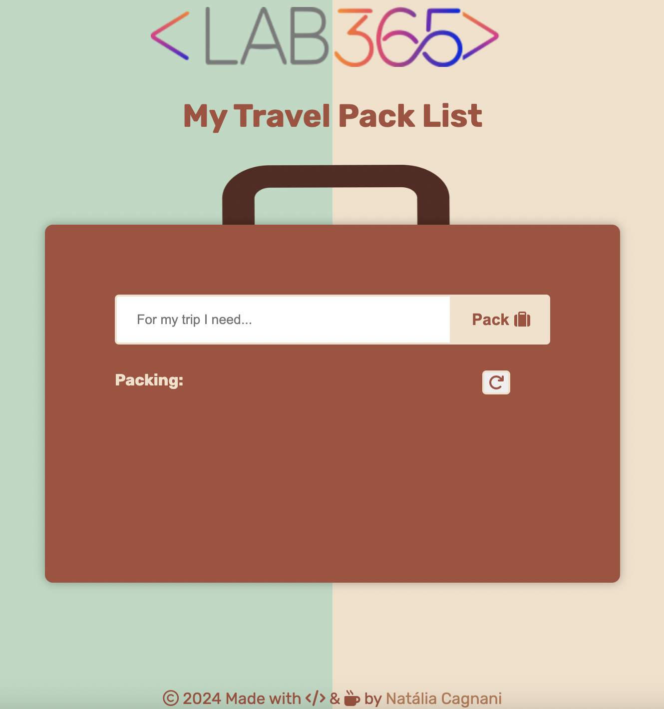
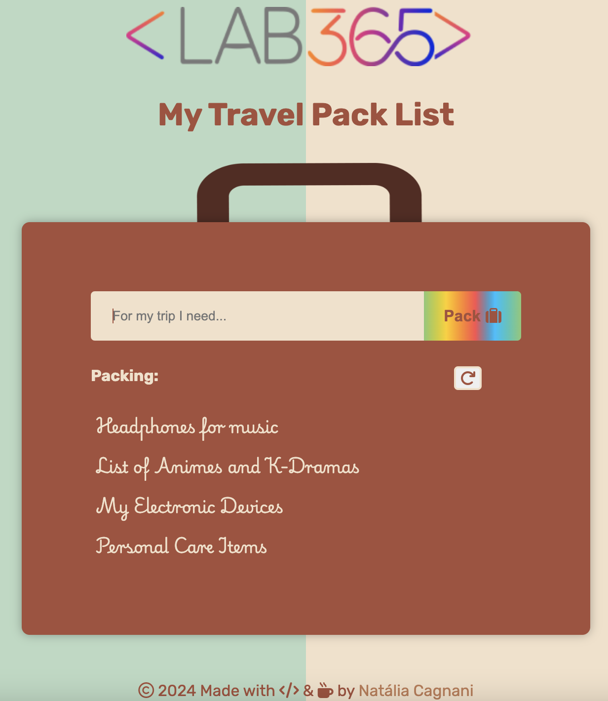
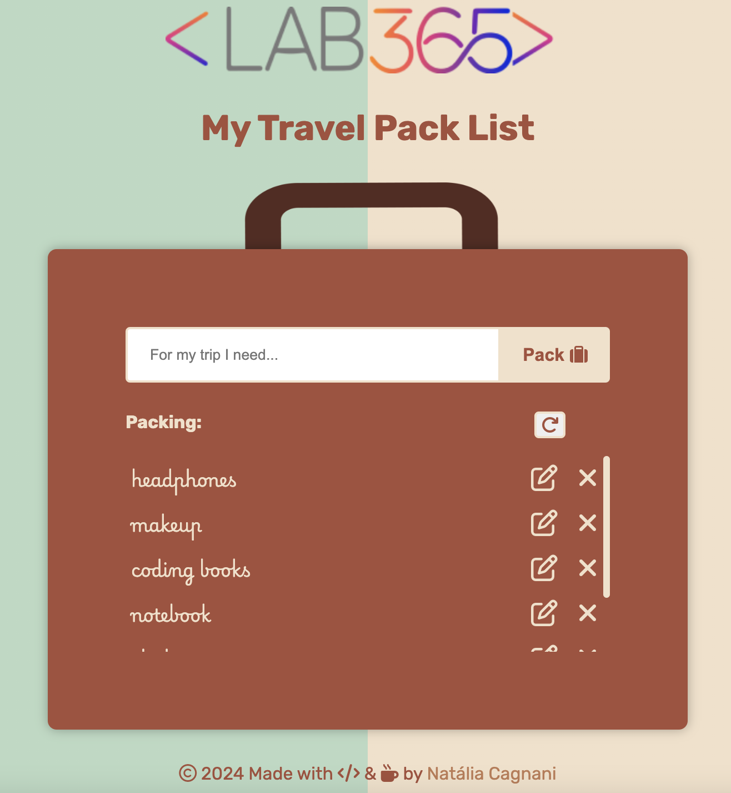
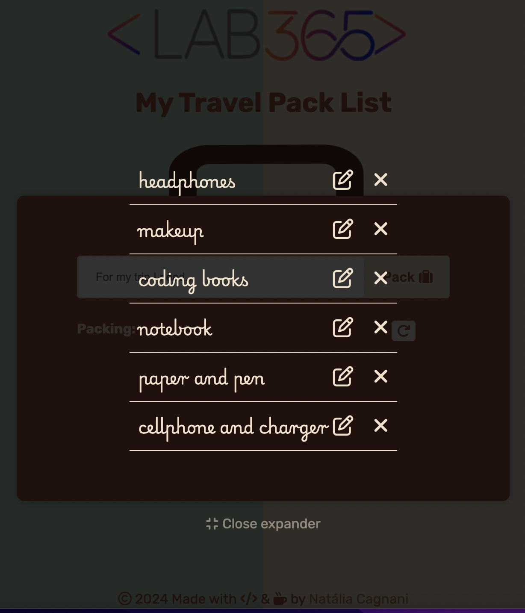

# Mini Project for Module 2

## Travel Packing List 🧳 🛫

This mini project was created for Module 2 of #FuturoDEV course from FMT. It's a simple list using a baggage format to add items before packing for a trip, including the option to expand the bag when the list is longer. 

---

### Technologies ✈️

- HTML
- CSS
- JavaScript

---

### Sample

<h4 align="center">
Before</h4>

 

<h4 align="center">
After</h4>
</h4>
 

<h4 align="center">
More options</h4>
</h4>
 

<h4 align="center">
List expanded</h4>
</h4>
